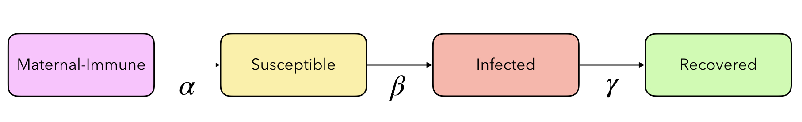

# Epidemiological Models

Collection of different [epidemiological compartmental models](https://en.wikipedia.org/wiki/Compartmental_models_in_epidemiology) in NetLogo. The available models and their schemes are detailed below. 

    

## Models

[1. Susceptible–Infected–Recovered (SIR)](#SIR)

[2. Susceptible–Infected–Susceptible (SIS)](#SIS)

[3. Susceptible–Exposed–Infected–Susceptible (SEIS)](#SEIS)

[4. Susceptible–Exposed–Infected–Recovered (SEIR)](#SEIR)

[5. Susceptible–Infected–Recovered–Carrier (SIRC)](#SIRC)

[6. Susceptible–Infected–Recovered–Carrier–Susceptible (SIRCS)](#SIRCS)

[7. Maternal-Immune–Susceptible-Infected-Recovered (MSIR)](#MSIR)

[8. Maternal-Immune–Susceptible–Exposed–Infected–Recovered (MSEIR)](#MSEIR)

[9. Maternal-Immune–Susceptible–Exposed–Infected–Recovered-Susceptible (MSEIRS)](#MSEIRS)

 <a name="SIR"/>

### 1. Susceptible–Infected–Recovered (SIR)

    

 <a name="SIS"/>

### 2. Susceptible–Infected–Susceptible (SIS)

    

 <a name="SEIS"/>

### 3. Susceptible–Exposed–Infected–Susceptible (SEIS)

    

 <a name="SEIR"/>

### 4. Susceptible–Exposed–Infected–Recovered (SEIR)

    

 <a name="SIRC"/>

### 5. Susceptible–Infected–Recovered–Carrier (SIRC)

    

 <a name="SIRCS"/>

### 6. Susceptible–Infected–Recovered–Carrier–Susceptible (SIRCS)

    

 <a name="MSIR"/>

### 7. Maternal-Immune–Susceptible-Infected-Recovered (MSIR)

    

 <a name="MSEIR"/>

### 8. Maternal-Immune–Susceptible–Exposed–Infected–Recovered (MSEIR)

    

 <a name="MSEIRS"/>

### 9. Maternal-Immune–Susceptible–Exposed–Infected–Recovered-Susceptible (MSEIRS)

    

## Usage
Select the values of the different parameters of the models. Press `setup` for initialize the simulation and `go` to start.
For more information about each model, check the `Info`.

